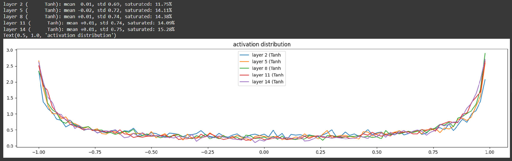
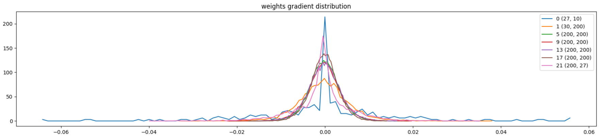
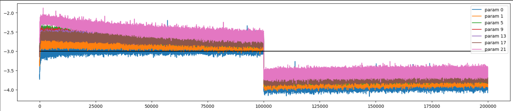

#  Makemore_bigram_model

## Introduction
In this project I have implemented a Multi Layer Perceptron character level language model to generate new names based on the training dataset. The objective of this project is to explore the basics of machine learning: model training, avoiding overfitting/underfitting, hyperparameter tuning. It also focuses on the process of forward and backward propagation, weight initialization, issues faced in this and how they are tackled with (Kaming Initialization, BaTchNorm layer)

##  Project Description
###  Prerequisites
-  Python 3.7
-  Cudo 10.1 or higher (for GPU support)
-  pip (Python Package Installer)

###  Dataset Overview
The text file 'names.txt' contains more than 32k names, using these names the bigram model is trained.

###  Process
1.  Read the 'names.txt' file and got all the characters from the text
2.  Made a string to integer and integer to string mapping of all the characters
3.  The number of characters(block_size) considered for lookback is 3, created a multidimensional list that will store lists containing 3 previous characters and a targets list that stores the preceding character
4.  Developed the linear, batchnorm and tanh activation layers from scratch instead of using the builtin pytorch layers for better understanding of the flow of data and gradients in a neural network and the operations performed on it
5.  Using the kaiming weight initialization, multiplying the weights by a factor of '5/3' to prevent the over shrinking of values by the tanh activation layer, the embedding dimensions were 10 and the number of neurons in hidden layer were 200
6.  The model was trained for 200000 steps and with a batch size of 32, a decaying learning rate algorithm was used

### Metrics achieved
-  Training Accuracy: 1.9712
-  Validation Accuracy: 2.0715
-  Activation Distribution

This is a histogram that shows the values of activation of tanh function during forward propagation for all hidden layers except the last layer. The plot shows that how many activations take a value between -1.0 and 1.0(range of tanh). The purpose of this plot was to visualize the activations and ensure that the saturation is under a certain threshold. Throught this plot we can visualize how the weight initializations affect the values of the activations in the hidden layers

-  Gradients to Parameters ratio

This is a plot that shows the ratio of all the gradients of the weights by the weights of the linear layers. The gradient to data ratio is ideally around 1e-2, which as visible from the plot I was able to obtain.

-  Weights update to Weights ratio

This plot shows the update that each parameter undergoes during backpropagation. This plot helps us to find the ideal learning rate, if the size of the updates is small (less than -3) then we can increase the learning rate and vice versa. 

###  Generation from the model:
-  Here's the names that the model generated:

